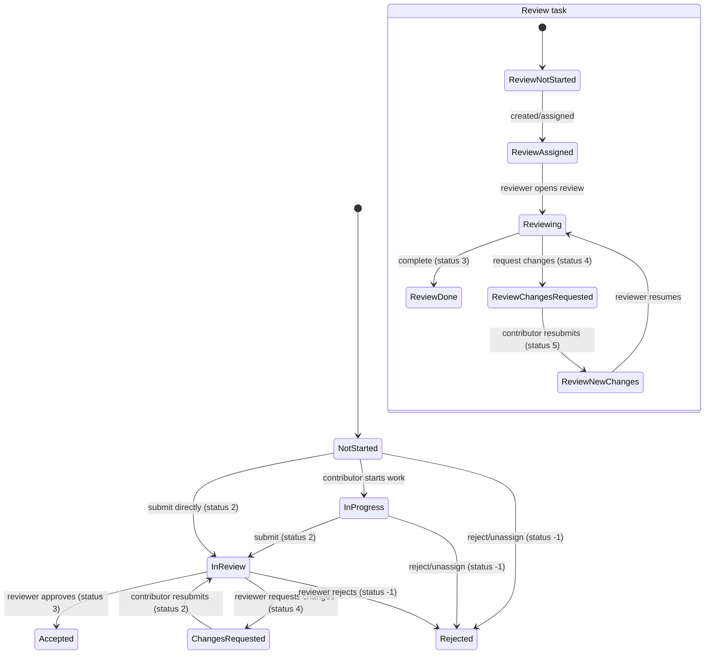

# Pipeline And Settings Map

## Contents
- Pipeline diagram
- State diagram
- End-to-end pipeline
- Task state machine
- Review state machine
- Setting-to-code map
- Runtime call graph

## Pipeline diagram
```mermaid
flowchart TD
    A["Project created (`create-new-project.ts`)"] --> B["Root task: `crowdsourcing-project` (status 0 paused)"]
    B --> C["User starts claim (`prepareResourceClaim`)"]
    C --> D["`ensureProjectTaskStructure` creates/finds parent tasks"]
    D --> E["Policy gate: `canUserClaimResource` + project config"]
    E -->|Denied| X["Claim rejected (max contributors / policy)"]
    E -->|Allowed| F["`createResourceClaim`"]
    F --> G["Clone/create capture model for resource target"]
    G --> H["Create/reuse `crowdsourcing-task`"]
    H --> I["Contributor edits revision"]
    I --> J["Claim/task status update to `2` (submitted)"]
    J --> K["`crowdsourcing-task` handler `status.2`"]
    K --> L{"Has `state.reviewTask`?"}
    L -->|Yes| M["Update review to `status 5` (new changes)"]
    L -->|No| N["Find active review under parent"]
    N --> O{"Existing active review?"}
    O -->|No| P["Create `crowdsourcing-review` subtask"]
    O -->|Yes| Q["Link user task to first active review"]
    P --> R["`crowdsourcing-review` event: `created`"]
    R --> S["Assign reviewer (`assign-review.ts`)"]
    S --> T["`assigned` event + notification + optional bot"]
    M --> U["Reviewer actions (`crowdsourcing-api.ts`)"]
    Q --> U
    T --> U
    U -->|Request changes| V["User task -> `status 4`"]
    U -->|Reject| W["User task -> `status -1`"]
    U -->|Approve| Y["User task -> `status 3`"]
    Y --> Z["`crowdsourcing-task` handler `status.3`"]
    Z --> AA["Sync/complete review tasks + parent manifest/canvas tasks"]
    AA --> AB["Reindex resource + notifications + membership updates"]
```

## State diagram


## End-to-end pipeline

### 1) Project bootstrap
- Project root task is created in `services/madoc-ts/src/routes/projects/create-new-project.ts` as `type: 'crowdsourcing-project'`.
- No user contribution/review tasks are created at this point.

### 2) Claim preparation and structure creation
- Entry routes:
  - `prepareResourceClaim` in `services/madoc-ts/src/routes/projects/create-resource-claim.ts`
  - `createResourceClaim` in `services/madoc-ts/src/routes/projects/create-resource-claim.ts`
- `ensureProjectTaskStructure(...)` creates missing parent structure tasks on demand:
  - `crowdsourcing-manifest-task` for manifest subject
  - `crowdsourcing-canvas-task` for canvas subject (unless manifest-only mode)
- Parent task `state` receives:
  - `maxContributors`
  - `approvalsRequired`
  - `warningTime`

### 3) Claim gating decision
- `canUserClaimResource(...)` in `services/madoc-ts/src/utility/claim-utilities.ts` applies core policy:
  - `claimGranularity`
  - max contributors
  - repeat-submission/rejection policies
- Additional guards in `create-resource-claim.ts` enforce:
  - manifest-only model mode
  - revision mismatch handling
  - prevent edits while in review

### 4) User contribution task creation
- `createUserCrowdsourcingTask(...)` in `create-resource-claim.ts` builds `crowdsourcing-task` via `gateway/tasks/crowdsourcing-task.ts#createTask`.
- `crowdsourcing-task.parameters`:
  - `[captureModelId, structureId, resourceType]`
- `crowdsourcing-task.state` includes:
  - `revisionId`
  - `reviewTask`
  - `warningTime`
  - `userManifestTask`

### 5) Submission and review linkage
- User marks task `status=2` (submitted/in review).
- `crowdsourcing-task` handler `status.2` does:
  - If `reviewTask` already present, bumps review to `status=5` (new changes)
  - Else creates/reuses a `crowdsourcing-review` subtask on parent
  - Records delegated relationship (`delegated_task`) back on user task

### 6) Reviewer assignment
- Review task creation/assignment handled via `gateway/tasks/crowdsourcing-review.ts` and `routes/projects/assign-review.ts`.
- Assignment order:
  1. Parent task assignee
  2. Random reviewer (optional)
  3. Manually configured reviewer
  4. Admin fallback
- Auto-review bot can act on assigned/created review when enabled.

### 7) Review actions and outcomes
- Implemented in `extensions/capture-models/crowdsourcing-api.ts`:
  - Reject -> task `status=-1`
  - Request changes -> task `status=4`
  - Approve -> task `status=3`
  - Merge prepare/discard/approve flows update review state and related user tasks
- `onRevisionApproved` hook is invoked when configured on the project template.

### 8) Completion propagation
- `crowdsourcing-task status.3` can close review tasks and update parent manifest/canvas tasks.
- Parent manifest/canvas tasks can mark themselves complete when expected children are complete.

## Task state machine (`crowdsourcing-task`)
- `-1`: rejected
- `0`: not started
- `1`: in progress
- `2`: in review/submitted
- `3`: done/accepted
- `4`: changes requested

Primary transitions:
- `0|1 -> 2`: user submits revision
- `2 -> 3`: reviewer approves
- `2 -> 4`: reviewer requests changes
- `4 -> 2`: user re-submits
- `any -> -1`: rejection/unassignment paths

## Review state machine (`crowdsourcing-review`)
- `-1`: rejected
- `0`: not started
- `1`: accepted
- `2`: reviewing
- `3`: done
- `4`: changes requested
- `5`: requested changes submitted / new changes

Primary transitions:
- `created -> assigned`
- `assigned -> reviewing`
- `reviewing -> done`
- `reviewing -> changes requested`
- `changes requested -> new changes`

## Setting-to-code map

### Contribution gating and claim behavior
- `claimGranularity`
  - Used in `create-resource-claim.ts`, `claim-utilities.ts`, `site-manifest-tasks.ts`, `use-canvas-user-tasks.ts`
- `maxContributionsPerResource`
  - Used in `create-resource-claim.ts`, `claim-utilities.ts`, `site-manifest-tasks.ts`, `site-canvas-tasks.ts`
- `modelPageOptions.preventContributionAfterRejection`
  - Used in `claim-utilities.ts`, client submission hooks
- `modelPageOptions.preventContributionAfterSubmission`
  - Used in `create-resource-claim.ts`, client submission hooks
- `modelPageOptions.preventMultipleUserSubmissionsPerResource`
  - Used in `claim-utilities.ts`, `create-resource-claim.ts`, client submission hooks
- `modelPageOptions.preventContributionAfterManifestUnassign`
  - Used in `site-manifest-tasks.ts`
- `allowSubmissionsWhenCanvasComplete`
  - Used in `use-canvas-user-tasks.ts`, crowdsourcing-task page behavior
- `shadow.showCaptureModelOnManifest`
  - Used in `create-resource-claim.ts`, `crowdsourcing-task.ts`, multiple frontend manifest/canvas entry points

### Review assignment and approvals
- `randomlyAssignReviewer`
  - Used in `assign-review.ts`
- `manuallyAssignedReviewer`
  - Used in `assign-review.ts`
- `adminsAreReviewers`
  - Used in `assign-review.ts`
- `revisionApprovalsRequired`
  - Applied to parent task state in `create-resource-claim.ts`; used in completion logic in `crowdsourcing-task.ts`
- `reviewOptions.enableAutoReview`
  - Used by `automation/bots/AutomaticReviewBot.ts`
- `reviewOptions.allowMerging`
  - Used by review UI (`preview-crowdsourcing-task.tsx`)

### Time/warning behavior
- `contributionWarningTime`
  - Propagated into task state in `create-resource-claim.ts`
- `shortExpiryTime` / `longExpiryTime`
  - Used by cron expiry logic in `cron/check-expired-manifests.ts`

## Runtime call graph
- Claim path:
  - `prepareResourceClaim` -> `ensureProjectTaskStructure` -> `canUserClaimResource`
  - `createResourceClaim` -> `createUserCrowdsourcingTask` -> `crowdsourcing-task`
- Submission path:
  - `updateResourceClaim` or claim update to `status=2` -> `crowdsourcing-task status.2`
- Review path:
  - `assign-review.ts` -> `crowdsourcing-review` events
  - Review actions in `crowdsourcing-api.ts` -> `updateRevisionTask` route -> task status/state updates

## Currently defined but not wired in main runtime
- `ProjectTemplate.configuration.tasks.generateOnCreate`
- `ProjectTemplate.configuration.tasks.generateOnNewContent`
- `ProjectTemplate.hooks.onCreateReview`
- `ProjectTemplate.hooks.onAssignReview`

These exist in template types and examples, but there are no active runtime call sites in core task/review pipeline files.
